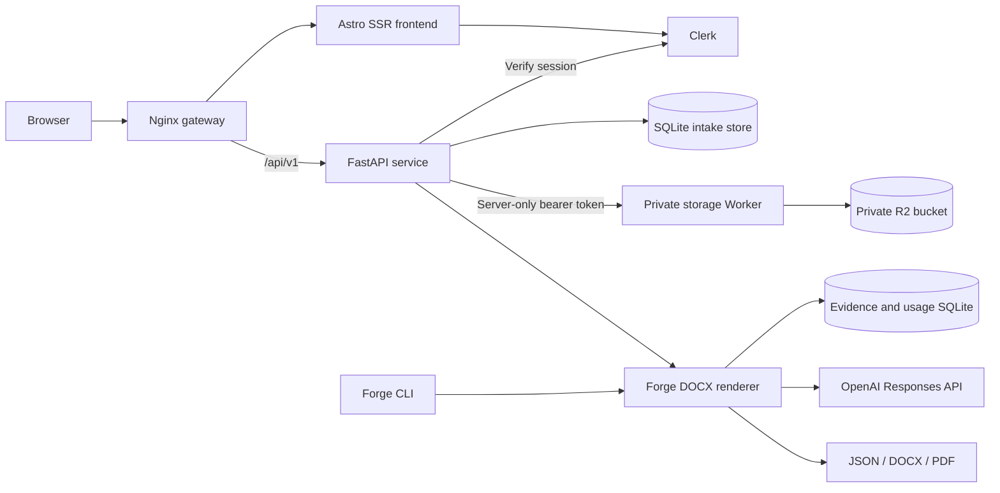

# Architecture

Axelyn Forge is organized around three independently testable and deployable boundaries.

## Boundaries

`apps/web` owns the public presentation, Clerk controls, protected `/app` route, and browser interaction. It runs as an Astro SSR service so middleware can resolve the session before rendering protected pages. The browser talks only to the same-origin versioned HTTP API.

`apps/api` owns HTTP concerns: request validation, CORS, Clerk session verification, public route versioning, service catalog exposure, resume metadata, and intake persistence. Every private resume query includes the authenticated Clerk user ID. Originals, review drafts, normalized versions, and generated documents use opaque object keys behind the server-only storage gateway.

`packages/forge-core` owns document-domain behavior. It remains independent of HTTP and can be driven through the `forge` CLI or imported by a later background worker. Template inspection, evidence selection, semantic operations, DOCX rendering, PDF conversion, and usage accounting stay in this package.

`infra` owns runtime assembly. Nginx routes pages to the private Astro service and `/api` to the private FastAPI service. It preserves the original host and scheme for safe Clerk redirects. SQLite state is kept in a named volume. Only the gateway publishes a host port locally. A separate core image contains LibreOffice and the `forge` CLI; candidate files are mounted when a workflow runs and are never copied into the public API image.

## Current request flow

1. Public visitors can submit `POST /api/v1/service-requests`; FastAPI validates the brief and writes it to SQLite with an opaque reference.
2. A visitor entering `/app` without a valid Clerk session is redirected to the same-origin sign-in route.
3. The browser submits the Clerk session cookie with `POST /api/v1/forge-briefs`.
4. FastAPI verifies the session, allowed party, and token type before associating the new brief with the Clerk user ID.
5. The caller receives an opaque brief reference and no private data is made queryable through a public endpoint.

## Resume library flow

1. The signed-in browser sends up to five DOCX/PDF files to the same-origin import endpoint.
2. FastAPI validates signatures and size limits, defensively extracts text, and writes the original plus a review draft to private object storage.
3. The user corrects the extracted fields and approves a named role version. The approved normalized payload becomes the rendering source.
4. The API maps approved content to the fixed Axelyn template bindings and stores the generated DOCX privately.
5. Download authorization checks both the document ID and Clerk user ID. Storage credentials and R2 object keys never reach browser code.

## Tailoring execution boundary

The existing tailoring workflow can take minutes, uses paid provider calls, and writes several artifacts. It should enter the HTTP product through an authenticated job endpoint and background worker rather than running inside a public request. The current split makes that extension straightforward: the API can enqueue a job, a worker can call `forge.tailoring`, and the API can expose status or signed artifact downloads without moving document logic into route handlers.

## Delivery

Pull requests and pushes to `main` run Python tests, the Astro type check and production build, and all Docker image builds. Pushes to `main` or a `v*` tag publish separate API, frontend, gateway, and core images to GitHub Container Registry. Deployment remains environment-specific, so the Clerk production keys and other credentials stay outside the repository.
