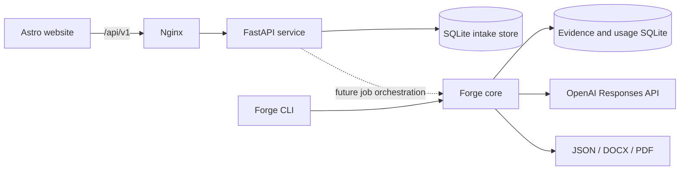

# Architecture

Axelyn Forge is organized around three independently testable and deployable boundaries.

## Boundaries

`apps/web` owns the public presentation and browser interaction. It is a static Astro build, so it can be served cheaply by Nginx or any static host. The browser talks only to the versioned HTTP API.

`apps/api` owns HTTP concerns: request validation, CORS, public route versioning, service catalog exposure, and intake persistence. Customer submissions receive opaque identifiers. The API intentionally has no public list or lookup endpoint for personal data.

`packages/forge-core` owns document-domain behavior. It remains independent of HTTP and can be driven through the `forge` CLI or imported by a later background worker. Template inspection, evidence selection, semantic operations, DOCX rendering, PDF conversion, and usage accounting stay in this package.

`infra` owns runtime assembly. Nginx serves the static website and proxies `/api` to the private API container. SQLite state is kept in a named volume. Only the web container publishes a host port. A separate core image contains LibreOffice and the `forge` CLI; candidate files are mounted when a workflow runs and are never copied into the public API image.

## Current request flow

1. The browser submits a JSON brief to `POST /api/v1/service-requests`.
2. FastAPI validates the identity fields, selected service, URL, summary length, and explicit consent.
3. The API writes the request to SQLite in one transaction with `received` status.
4. The caller receives an opaque request reference and no private data is made queryable through the public API.

## Tailoring execution boundary

The existing tailoring workflow can take minutes, uses paid provider calls, and writes several artifacts. It should enter the HTTP product through an authenticated job endpoint and background worker rather than running inside a public request. The current split makes that extension straightforward: the API can enqueue a job, a worker can call `forge.tailoring`, and the API can expose status or signed artifact downloads without moving document logic into route handlers.

## Delivery

Pull requests and pushes to `main` run Python tests, the Astro type check and production build, and all Docker image builds. Pushes to `main` or a `v*` tag publish separate API, web, and core images to GitHub Container Registry. Deployment remains environment-specific, so production credentials and domain decisions stay outside the repository.
