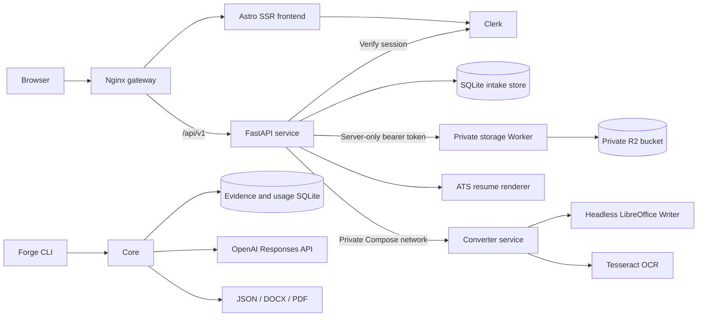

# Architecture

Axelyn Forge is organized around independently testable and deployable application boundaries.

## Boundaries

`apps/web` owns the public presentation, Clerk controls, protected `/app` route, and browser interaction. It runs as an Astro SSR service so middleware can resolve the session before rendering protected pages. The browser talks only to the same-origin versioned HTTP API.

`apps/api` owns HTTP concerns: request validation, CORS, Clerk session verification, public route versioning, service catalog exposure, resume metadata, and intake persistence. Every private resume query includes the authenticated Clerk user ID. Originals, review drafts, normalized versions, and generated documents use opaque object keys behind the server-only storage gateway.

`apps/converter` owns resource-bounded office document conversion and image OCR. It has no public route or published port. Each request uses isolated temporary files, validates document signatures and image dimensions, and runs under a one-operation default concurrency limit. LibreOffice produces PDFs; Tesseract reads PNG/JPEG job-post screenshots.

`packages/forge-core` owns document-domain behavior. It remains independent of HTTP and can be driven through the `forge` CLI or imported by a later background worker. Template inspection, evidence selection, semantic operations, DOCX rendering, PDF conversion, and usage accounting stay in this package.

`infra` owns runtime assembly. Nginx routes pages to the private Astro service and `/api` to the private FastAPI service. It preserves the original host and scheme for safe Clerk redirects. SQLite state is kept in a named volume. Only the gateway publishes a host port locally. LibreOffice runs in the private converter and CLI images; candidate files are never copied into the public API image.

## Current request flow

1. Public visitors can submit `POST /api/v1/service-requests`; FastAPI validates the brief and writes it to SQLite with an opaque reference.
2. A visitor entering `/app` without a valid Clerk session is redirected to the same-origin sign-in route.
3. The browser submits the Clerk session cookie with `POST /api/v1/forge-briefs`.
4. FastAPI verifies the session, allowed party, and token type before associating the new brief with the Clerk user ID.
5. The caller receives an opaque brief reference and no private data is made queryable through a public endpoint.

## Resume library flow

1. The signed-in user creates a first resume with the guided form or sends up to five DOCX/PDF files to the same-origin import endpoint.
2. FastAPI validates imported signatures and size limits, defensively extracts text, and writes the original plus structured editable content to private object storage. A form-created source stores the structured record directly.
3. One builder edits both source types. Standard fields cover common resume content; custom sections preserve publications, awards, volunteering, clearances, and other uncommon material.
4. For imports, the original extracted transcript stays read-only. Lines that are not represented by a standard or custom field appear in a source inbox, so an edit cannot silently discard them.
5. The user selects Classic, Modern, or Compact. Each renderer uses a single reading order, selectable text, standard headings, and no tables, columns, icons, or text boxes.
6. The user approves a named role version. The API renders every populated section into DOCX, then sends it to the private converter, where headless LibreOffice returns a validated PDF.
7. The API stores both files as one generated bundle. Download authorization checks both the document ID and Clerk user ID. Storage credentials and R2 object keys never reach browser code.

## Job match and tailoring flow

1. The signed-in user selects one owned resume, pastes a job description, or uploads PDF, DOCX, TXT, PNG, or JPEG source files.
2. FastAPI extracts document text and sends images to the private Tesseract service. It compares the role language with the latest saved resume sections and records Match at 70–100%, Some match at 40–69%, or No match at 0–39%.
3. The result explains supported terms, missing terms, source evidence, and specific improvement directions. It never treats an unsupported requirement as candidate experience.
4. Match results generate automatically; Some match results offer generation; No match results stop before generation.
5. Tailoring prioritizes existing roles, projects, bullets, skills, and custom sections without rewriting claims. The selected ATS renderer creates DOCX, LibreOffice creates PDF, and both files remain owner-scoped through download.

## Delivery

Pull requests and pushes to `main` run Python tests, the Astro type check and production build, and all Docker image builds. Pushes to `main` or a `v*` tag publish separate API, converter, frontend, gateway, and core images to GitHub Container Registry. Deployment remains environment-specific, so the Clerk production keys and other credentials stay outside the repository.
