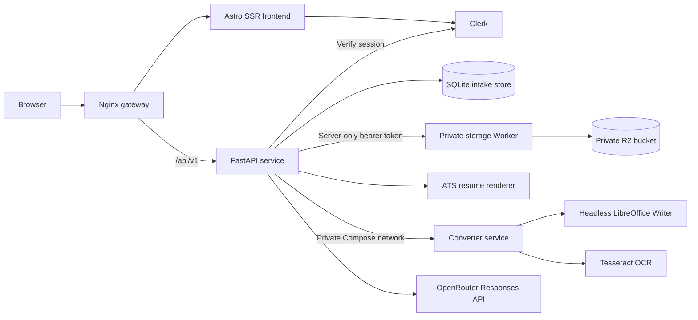

# Architecture

Axelyn Forge is organized around independently testable and deployable application boundaries.

```mermaid
flowchart LR
    Browser[Browser] --> Proxy[Nginx gateway]
    Proxy --> Frontend[Astro SSR frontend]
    Proxy -->|/api/v1| API[FastAPI service]
    Frontend --> Clerk[Clerk]
    API -->|Verify session| Clerk
    API --> Intake[(SQLite intake store)]
    API -->|Server-only bearer token| StorageWorker[Private storage Worker]
    StorageWorker --> R2[(Private R2 bucket)]
    API --> ResumeRenderer[ATS resume renderer]
    API -->|Private Compose network| Converter[Converter service]
    Converter --> LibreOffice[Headless LibreOffice Writer]
    Converter --> Tesseract[Tesseract OCR]

    API --> Provider[OpenRouter Responses API]
```

## Boundaries

`apps/web` owns the public presentation, Clerk controls, protected `/app` route, and browser interaction. It runs as an Astro SSR service so middleware can resolve the session before rendering protected pages. The browser talks only to the same-origin versioned HTTP API.

`apps/api` owns HTTP concerns: request validation, CORS, Clerk session verification, public route versioning, service catalog exposure, resume metadata, and intake persistence. Every private resume query includes the authenticated Clerk user ID. Originals, review drafts, normalized versions, and generated documents use opaque object keys behind the server-only storage gateway.

`apps/converter` owns resource-bounded office document conversion and image OCR. It has no public route or published port. Each request uses isolated temporary files, validates document signatures and image dimensions, and runs under a one-operation default concurrency limit. LibreOffice converts uploaded PDFs to normalized Word sources and generated DOCX files to PDFs; Tesseract reads PNG/JPEG job-post screenshots.

`packages/forge-core` contains only the document and provider primitives shared by the API and converter.

`infra` owns runtime assembly. Nginx routes pages to the private Astro service and `/api` to the private FastAPI service. It preserves the original host and scheme for safe Clerk redirects. SQLite state is kept in a named volume. Only the gateway publishes a host port locally. LibreOffice runs in the private converter and CLI images; candidate files are never copied into the public API image.

## Current request flow

1. Public visitors can submit `POST /api/v1/service-requests`; FastAPI validates the brief and writes it to SQLite with an opaque reference.
2. A visitor entering `/app` without a valid Clerk session is redirected to the same-origin sign-in route.
3. FastAPI verifies the session, allowed party, and token type before any private resume, job-tracker, or job-match operation.
4. Every private query includes the authenticated Clerk user ID, and no private data is made queryable through a public endpoint.

## Resume library flow

1. The signed-in user sends up to five DOCX/PDF files to the same-origin import endpoint.
2. FastAPI validates imported signatures and size limits. A PDF is first converted into DOCX by the private LibreOffice service; an uploaded DOCX becomes the normalized Word source directly.
3. Forge inventories the normalized document's paragraphs and layout hints. OpenRouter assigns editable nodes semantic JSON Pointers; a deterministic fallback supplies line bindings when AI planning is unavailable.
4. Forge wraps the selected paragraphs in Structured Document Tags without rebuilding their paragraphs, runs, tables, styles, margins, or section settings. It derives an example JSON document and a Draft 2020-12 schema for that particular layout.
5. The library exposes the personalized SDT DOCX, its matching PDF, example JSON, and JSON Schema. The original source and JSON-to-SDT binding manifest remain internal and owner-scoped.
6. `POST /api/v1/resumes/{id}/render` validates changed JSON against that resume's schema, applies values through its private manifest, and returns DOCX or a LibreOffice-rendered PDF.
7. The current binding engine updates existing scalar paragraphs. Array sizes are fixed in the generated schema until repeatable Word block cloning is implemented.
8. Download and rendering authorization check both the resume or artifact ID and Clerk user ID. Storage credentials, object keys, and the private binding manifest never reach browser code.

## Job match and tailoring flow

1. The signed-in user selects one owned resume, pastes a job description, or uploads PDF, DOCX, TXT, PNG, or JPEG source files.
2. FastAPI extracts document text and sends images to the private Tesseract service. It compares the role language with the latest saved resume sections and records Match at 70–100%, Some match at 40–69%, or No match at 0–39%.
3. The result explains supported terms, missing terms, source evidence, and specific improvement directions. It never treats an unsupported requirement as candidate experience.
4. Match results generate automatically; Some match results offer generation; No match results stop before generation.
5. Tailoring prioritizes existing roles, projects, bullets, skills, and custom sections without rewriting claims. The selected ATS renderer creates DOCX, LibreOffice creates PDF, and both files remain owner-scoped through download.

## Job tracker flow

1. The signed-in user creates an application record with the company, role, posting URL, status, dates, notes, and one owned resume source.
2. FastAPI validates that both the application and selected resume belong to the same Clerk user. It stores the resume IDs, name and target-role labels, and a private content snapshot representing the version used for that application.
3. The user can move the record through Saved, Applied, Screening, Interview, Offer, Rejected, or Withdrawn and can filter the pipeline in the browser.
4. On demand, OpenRouter receives the role context, optional job description, and a server-built catalog of verified facts from the attached snapshot. It returns a strict interview brief with coverage, likely questions, evidence-linked answer plans, questions to ask, and preparation actions. Evidence references are limited to catalog IDs, so unsupported claims remain visible gaps.
5. If a linked resume is later removed, SQLite clears the obsolete source and version IDs while retaining the owner-scoped attachment snapshot for an accurate application history. Deleting the application also deletes its private snapshot and saved interview brief.

## Delivery

Pull requests and pushes to `main` run Python tests, the Astro type check and production build, and all Docker image builds. Pushes to `main` or a `v*` tag publish separate API, converter, frontend, and gateway images to GitHub Container Registry. Deployment remains environment-specific, so the Clerk production keys and other credentials stay outside the repository.
